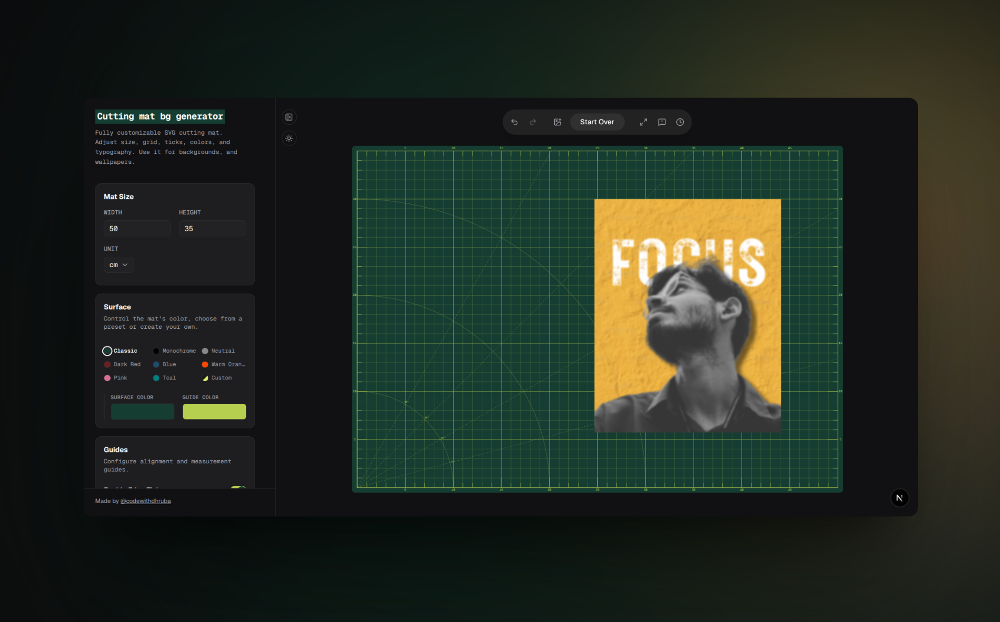

# Professional SVG Cutting Mat Background Generator



A premium, highly customizable web application designed to generate precision SVG cutting mat backgrounds. Built for designers, crafters, and developers who need pixel-perfect grids, customizable layouts, and robust export capabilities.

##  Key Features

* **Advanced Grid Customization**: Fine-tune your cutting mat's dimensions, padding, grid density, sub-grids, and visual thickness.
* **Unit Flexibility**: Seamlessly toggle between Millimeters (mm), Centimeters (cm), and Inches (in) with mathematically precise scaling.
* **Image Import & Manipulation**: Upload overlay images directly onto the mat. Precisely scale, rotate, adjust opacity, and modify border radius through dedicated controls.
* **Robust History System**: Make mistakes fearlessly. Features a fully-integrated, debounced global Undo/Redo engine that tracks both mat settings and image manipulations.
* **Dark & Light Themes**: Beautiful, hand-crafted color palettes with system-sync and seamless dark mode toggling, ensuring the app looks gorgeous in any lighting.
* **Precision Exporting**: 
  * **Export to SVG**: Download a pristine, infinitely scalable vector graphic of your mat.
  * **Export to PNG**: Download a high-resolution, background-free transparent PNG of your current workspace.
* **Mobile Responsive**: Carefully crafted slide-up drawer controls for mobile users, keeping the workspace unhindered on smaller devices.

## Technology Stack

This project is built with modern, performant web technologies:

* **Framework**: [Next.js](https://nextjs.org/) (App Router)
* **Language**: [TypeScript](https://www.typescriptlang.org/)
* **Styling**: [Tailwind CSS](https://tailwindcss.com/)
* **UI Components**: [Shadcn UI](https://ui.shadcn.com/) & Radix UI
* **Icons**: [Lucide React](https://lucide.dev/)
* **Theme Management**: `next-themes`

## Getting Started

To run this project locally, follow these steps:

### Prerequisites
Make sure you have Node.js installed (v18 or higher recommended).

### Installation

1. **Clone the repository:**
   ```bash
   git clone https://github.com/codewithdhruba01/Cutting_Mat.git
   cd cutting-mat
   ```

2. **Install dependencies:**
   ```bash
   npm install
   # or yarn install
   # or pnpm install
   ```

3. **Start the development server:**
   ```bash
   npm run dev
   # or yarn dev
   # or pnpm dev
   ```

4. **Open your browser:**
   Navigate to [http://localhost:3000](http://localhost:3000) to see the application running.

##  Project Structure highlights

* `src/app/`: Next.js App Router pages and root layouts.
* `src/components/`: Reusable UI components (Sidebar, TopToolbar, PreviewArea).
* `src/contexts/`: Global state management (`WorkspaceContext` for undo/redo, `ThemeContext`).
* `src/utils/`: Math and conversion utilities for generating pixel-perfect SVGs.
* `src/types/`: Centralized TypeScript definitions.

## 🤝 Contributing

Contributions, issues, and feature requests are welcome! 
Feel free to check [issues page](https://github.com/codewithdhruba/Cutting_Mat/issues) if you want to contribute.

## 📝 License

This project is open-source and available under the [MIT License](LICENSE).

---
*Crafted with precision by [@codewithdhruba](https://codewithdhruba.in/)*
